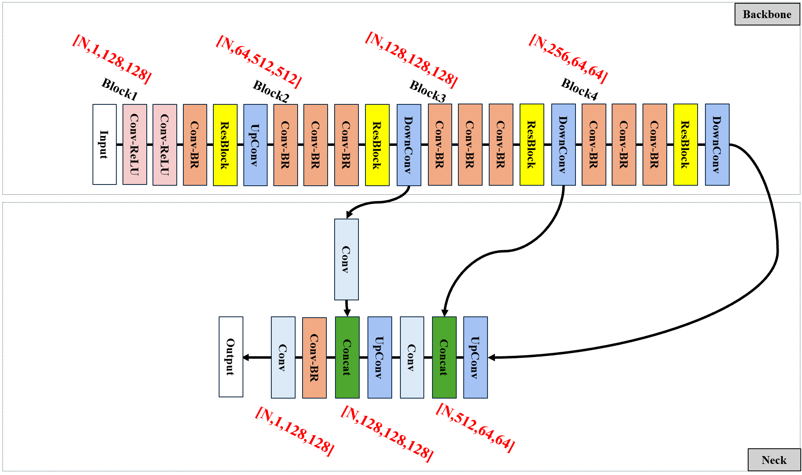

<h1 align="center">FFCNN（Feature Fusion Convolutional Neural Network）
   
用于图像去噪的特征融合卷积神经网络 </h1>

# 使用方法：
1. 本项目的文件结构如下：
   - datasets文件夹：存放训练集和测试集
   - demo文件夹：存放训练脚本(`train.py`)和推理脚本(`detect.py`)
   - model文件夹：存放数据加载(`dataload.py`)、模型结构(`net.py`)、损失计算(`loss.py`)、参数图像绘制(`graph.py`)的脚本
   - outputs文件夹
     - **推理结果**：存放每次推理的结果图像，其下文件夹以日期时间命名
     - **训练与性能情况**：存放每次训练的日志文件、参数曲线、每轮训练的效果图片，其下文件夹以日期时间命名
     - **weights**：存放每次训练的权重文件，其下文件夹以日期时间命名
  
2. 本项目的训练方法：
   - 首先配环境，在当前的conda环境中运行`pip install -r requirements.txt`，安装项目所需的基本python包。
   - 将训练集和测试集放入datasets文件夹
   - 在`dataload.py`脚本中修改**train_images_dir**、**train_labels_dir**、**val_image_dir**、**val_lable_dir**，替换为现在训练集、测试集路径
   - 在`train.py`中设置轮次数**EPOCHES**、批次数**BATCHSIZE**；若是从头开始训练，则**LOAD_CP**值需为False，表示不需要加载之前的检查点，若从上次中断的检查点开始训练，则**LOAD_CP**需为True，同时设置**CP_PATH**为检查点权重文件路径。
   - 运行`train.py`即可开始训练，训练性能情况在**训练与性能情况**文件夹中；权重文件在**weights**文件夹中

3. 本项目的推理方法：
   - 直接修改`detect.py`脚本中的**weight_name**参数为推理所使用的权重文件路径，运行`detect.py`即可，推理结果在outputs文件夹下的**推理结果**文件夹中

# 网络结构：

## **Backbone部分**：
此结构负责图像特征提取。使用层次化构建方法创建了4个卷积网络块，共44个卷积层。所有网络块均使用ResBlock(残差网络块)来最大程度避免出现过拟合。ResBlock 中包含一组Conv-ReLU(Convolution、ReLU，即卷积层和非线性激活层结构)、5组 Conv-BR (Convolution、BatchNorm、ReLu，即卷积层、批量归一化层和非线性激活层结构)，将输出的特征图和原始输入相加，再经过一层 ReLU 激活函数作为ResBlock 的输出，可以在不增加网络优化难度的情况下增加网络层数。  

   1. 具体来说，第一个卷积网络块共包含 11 个二维卷积层，负责将输入的输入特征图张量形状由[N,1,128,128] (TorchTensor的形状标准，即[批次数、通道数、高度、宽度])改变为[N,64,512,512]。所有卷积核大小均为3×3 ，卷积步长均为 1，同时进行边缘填充。输入特征图首先经过两组Conv-ReLU结构，然后再经过一组Conv-BR结构，即再进入ResBlock 残差块，最后经过UpConv 即上采样卷积层，对特征图尺寸进行更改。
   2. 第二个卷积网络块负责将输入特征图的形状由[N,64,512,512]改变为[N,128,128,128]，由于特征图张量形状变化的需求不同，其结构与第一个卷积网络块略有不同，体现在将最前的两组Conv-ReLU 结构改为Conv-BR结构，另外每一层二维卷积层的输入输出通道数略有不同。同时网络的最后一层也从UpConv替换为DownConv 即下采样卷积层，原因是从第二个卷积网络块开始构建尺寸逐级减小，通道维度逐级增加的特征图。
   3. 同样，第三个卷积网络块负责将特征图形状从[N,128,128,128]改变为[N,256,64,64]，第四个卷积网络块负责将特征图形状从[N,256,64,64]改变为[N,512,16,16]，第三、四层卷积网络块的结构与第二个卷积网络块完全相同，只是在某些层的输入输出通道数上有所差别。
   4. 最后，获取第二、第三、第四个卷积网络块的输出特征图，其中包含的位置信息从底层至高层逐级减少，语义信息则逐级增加，将这三层的特征图都进行提取，并在之后的 Neck 部分进行拼接融合，可以更好地减少信息流失。
## **Neck部分**：
该结构负责图像特征融合。设计原因在于网络底层的特征图中包含的特征语义信息比较少，但特征位置信息较为丰富，而网络高层的特征语义信息比较丰富，但特征位置信息比较少，通过将网络底层和网络高层的特征信息融合，可以有效避免随着网络深度增加而造成的信息流失，使得网络可以向更深发展。本文为来自Backbone的三种深度层级的特征图创建了一条融合通路。
   1. 首先将第四个卷积网络块输出的形状为[N,512,16,16]的特征图经过上采样卷积层 UpConv 将形状改变为[N,256,64,64],与第三个卷积网络块的输出做第一次Concat通道融合，输出的特征图形状为[N,512,64,64]。
   2. 之后再经过一个二维卷积层 Conv将形状改变为[N,128,64,64]，随后使用上采样卷积层 UpConv 将其形状再次调整为[N,64,128,128]，同时将第二个卷积网络块输出的形状为[N,128,128,128] 的特征图经过一个二维卷积层调整通道数，将形状变为[N,64,128,128],与之前三、四卷积网络块的融合结果做第二次Concat通道融合，结果形状为[N,128,128,128]。
   3. 至此三个深度层级的信息融合完成，再经过一个Conv-BR结构和一个二维卷积层进行形状微调之后，最终输出一个形状为[N，1，128，128]的特征图。

# **损失函数部分**：
为衡量网络输出图像与目标图像之间的差距，本项目使用了组合形式的损失函数，其中，总损失函数由三部分组成：MSE均方误差损失函数、L1最小绝对值偏差损失函数、感知损失。
   1. **MSE均方误差损失**：计算网络生成图像与目标图像之间逐像素值的L2范数，在回归任务中被大量使用，其公式为 $$MSE = \frac{1}{n}\sum_{i=0}^{n}(Y_i - Y_{true})^2 \quad$$ 其中Y_i为网络生成图像像素值，Y_true为网络生成图像真实像素值，由于出现对误差取平方，模型会更加倾向于避免较大误差，对异常值敏感，从而避免图像灰度出现极端值。
   2. **L1最小绝对误差损失**：计算网络生成图像和目标图像之间逐像素值之间的L1范数，公式为 $$L_1 = \frac{1}{n}\sum_{i=1}^{n}|Y_i - Y_{true}| \quad$$ 由于其仅对误差取绝对值，该损失函数倾向于对所有误差都给予相同的权重，对异常值不敏感，从而获得灰度分布更合理的图像
   3. **感知损失**：基于MSE、L1损失指导下的网络生成图像并不能很好地代表人眼对图像质量的直观感受，于是最早由Justin Johnso等人开始在图像超分辨率领域引入感知损失（Perceptual Loss）的概念，即使用一个预训练的神经网络来计算两张图片之间的差异，通常是使用一个已在大规模数据集上完成预训练的卷积神经网络来实现，这个网络可以提取图像的纹理和结构信息，对于衡量网络生成图像和目标图像之间的纹理、特征还原效果来说效果十分明显，其计算原理可以表示为 $$PerceptLoss = \frac{1}{N}\sum_{i=1}^{N}(F_i(X) - F_i(Y))^2 \quad$$ 其中N为感知网络层数，F_i (X)函数表示网络输出在感知网络第i层的特征图，F_i (Y)表示目标图像在感知网络第i层的特征图，由此可见感知损失所计算的其实是两个图像在感知网络各层输出空间中的输出向量之间的欧氏距离。本项目选择VGGNet19作为感知网络骨干，该网络共包含19个卷积层、5个池化层、3个全连接层，卷积核尺寸为3×3，池化核尺寸为2×2，激活函数为ReLU，该网络预先在ImageNet数据集上完成了1000个类别的分类训练。本文提取了网络的第3、8、17、26层的输出特征图作为感知损失计算的依据，将依次计算出来的感知损失作为网络总损失函数的一部分指导训练的进行。
   4. 为了在模型中综合使用以上三种损失函数，我们对其进行了加权求和，对于 MseLoss、L1Loss、PerceptLoss  三种损失函数的最合适占比，使用者可自行设计。
# 项目论文  
[链接](https://www.nature.com/articles/s41598-025-07107-1)